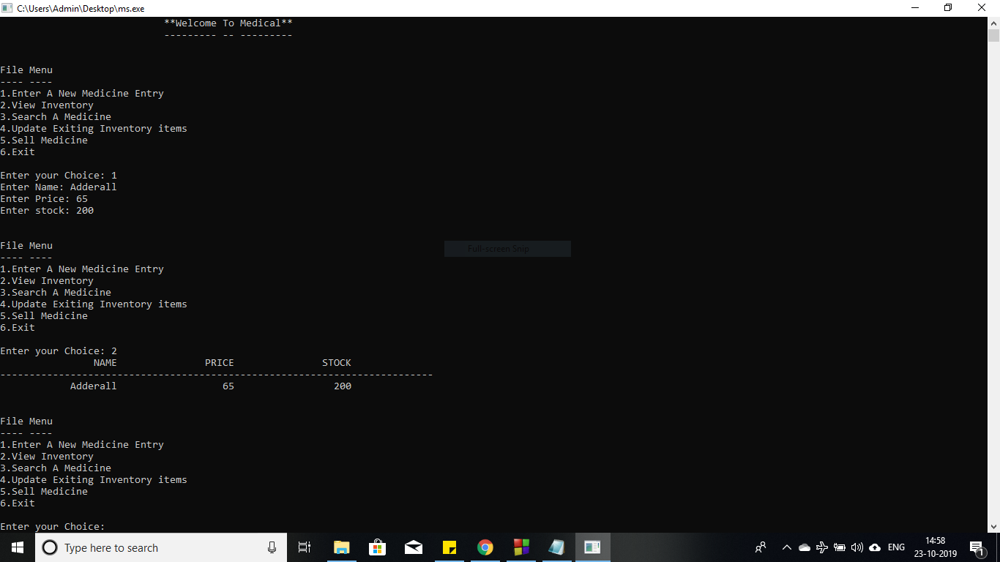

# Medical Store Management
As we know that nowadays being organised has been very important in our day to day life. Whether it may be a grocery store or a medical store. Here I have written a program in 'C++' which can be very useful in this kind of stores for the management of stocks (adding, removing and updating the stock information) and can also work as a billing program. I have used multiple data structure types in this program to make it more simplified.


## Getting Started
After downloading the following .txt file you will need to copy it into a IDE to get it running.


### Prerequisites
Firstly you will need to do some basic checkup. Make sure that your PC / Laptop meets these basic requirements:
1. Intel core i3
2. 2 GB RAM
3. 500 GB HDD
4. GCC or G++ compiler
5. IDE
   * [Code::Blocks 17.12](http://www.codeblocks.org/downloads)
   * [CodeLite 13.0.0](https://downloads.codelite.org/)
   * [JetBrains CLion 2019.3](https://www.jetbrains.com/clion/download/)
   
## Code
```c++
#include <iostream>
#include<fstream>
#include<cstring>
#include<iomanip>
#include<conio.h>
#include<stdlib.h>
using namespace std;

class Medicine
{
private:
    char name[20];
    double price;
    int stock;
public:
    void getInput();
    void showOutput();
    void fileWrite();
    void fileRead();
    int SearchRecord();
    void updateRecord();
    int SearchMed();
    void sellMedicine();
    void createBill(char*,int,double);
};
void Medicine::getInput()
{
    cout<<"Enter Name: ";
    cin>>name;
    cout<<"Enter Price: ";
    cin>>price;
    cout<<"Enter stock: ";
    cin>>stock;
}
void Medicine::showOutput()
{
    cout<<setw(20)<<name<<setw(20)<<price<<setw(20)<<stock<<endl;
}
void Medicine::fileWrite()
{
    fstream fout;
    fout.open("medicine.txt",ios::out|ios::app|ios::binary);
    fout.write((char*)this,sizeof(*this));
    fout.close();
}
void Medicine::fileRead()
{
    fstream fin;
    fin.open("medicine.txt",ios::in|ios::binary);
    cout<<setw(20)<<"NAME"<<setw(20)<<"PRICE"<<setw(20)<<"STOCK"<<endl;
    cout<<setw(20)<<"--------------------------------------------------------------------------"<<endl;
    while(fin.read((char*)this,sizeof(*this)))
    {
        this->showOutput();
    }
    fin.close();
}

int Medicine::SearchRecord()
{
    fstream fp;
    char nm[20];
    bool flag=false;
    int ps,i,offset;
    ps=-1;
    i=0;
    cout<<"\nEnter Name to Search Record : ";
    cin>>nm;
    fp.open("medicine.txt",ios::in|ios::binary);
    fp.read((char*)this,sizeof(*this));
    fp.seekg(0,ios::beg);
    while(fp.read((char*)this,sizeof(*this)))
    {
        if(strcmp(this->name,nm)==0)
        {
            ps=i;
            flag=true;
            break;
        }
        i++;

     }
     if(flag)
     {

        offset=ps*sizeof(*this);
        fp.seekp(offset);
        fp.read((char*)this,sizeof(*this));
        cout<<"\nRecord Found!";
        cout<<"\n------ ------\n\n";
        cout<<setw(20)<<"NAME"<<setw(20)<<"PRICE"<<setw(20)<<"STOCK";
        cout<<"\n----------------------------------------------------------------------------"<<endl;
        this->showOutput();
     }
     else
     {
         cout<<"\nRecord Not Found!";
         cout<<"\n------ --- ------\n\n";
     }
    fp.close();
}
struct bill_node
{
    char medname[20];
    int medunits;
    double medprice;
    struct bill_node*next;
};
struct bill_node *bill_root=NULL;

int Medicine::SearchMed()
{
    fstream fp;
    char mname[20];
    bool flag=false;
    int ps,i,offset;
    ps=-1;
    i=0;
    cout<<"\nEnter The Medicine Name: ";
    cin>>mname;
    fp.open("medicine.txt",ios::in|ios::binary);
    fp.seekg(0,ios::beg);
    while(fp.read((char*)this,sizeof(*this)))
    {
        if(strcmp(this->name,mname)==0)
        {
            ps=i;
            flag=true;
            break;
        }
        i++;
    }
    if(flag)
    {
        offset=ps*sizeof(*this);
        return offset;
    }
    else
    {
        cout<<"\nRecord Not Found!";
        cout<<"\n------ --- ------\n\n";
    }
    fp.close();
}

void Medicine::sellMedicine()
{
    int mstock;
    double mprice;
    int x=this->SearchMed();
    fstream file;
    cout<<"\nEnter The No. Of Units:\t";
    cin>>mstock;
    file.open("medicine.txt",ios::in|ios::out);
    file.seekp(x);
    if(mstock<this->stock)
    {
        this->stock=this->stock - mstock;
        mprice=this->price * mstock;
    }
    file.write((char*)this,sizeof(*this));
    createBill(this->name,mstock,mprice);
    file.close();
}
void Medicine::createBill(char*nm,int un,double pr)
{

    struct bill_node *temp;
    temp=new bill_node;
    strcpy(temp->medname,nm);
    temp->medunits=un;
    temp->medprice=pr;
    temp->next=NULL;
    if(bill_root==NULL)
    {
        bill_root=temp;
    }
    else
    {
        struct bill_node*p;
        p=bill_root;
        while(p->next!=NULL)
        {
            p=p->next;
        }
        p->next=temp;
    }
}

void payment(double k)
{
    double cash=0;
    double sum=k;
    pay:

	cout<<"\n\n\t\t\t****PAYMENT SUMMARY****\n";
	cout<<"\n\t\t\tTotal cash given: ";
	cin>>cash;

	if(cash>=sum)
		cout<<"\n\t\t\tTotal Cash Repaid: "<<cash-k<<'\n';

	else
	{	cout<<"\n\t\t\tCash Given Is Less Than Total Amount!!!";
        cout<<"\n\t\t\tYou Have To Pay Total "<<k<<" Rs!";

	goto pay;
	}
}
void Medicine::updateRecord()
{
    char choice,ch;
    int mstock,mexpired;
    double mprice;
    fstream file;
    int x=this->SearchRecord();
    cout<<"\nUpdate Menu";
    cout<<"\n------ ----";
    cout<<"\n1.Update Stock.\n2.Update Price.\n3.Remove Stock";
    do
    {
        cout<<"\n\nEnter Your Choice: ";
        cin>>choice;
        switch(choice)
        {
        case '1':
            cout<<"\nEnter Number Of Units Purchased:";
            cin>>mstock;
            file.open("medicine.txt",ios::in|ios::out);
            file.seekp(x);
            this->stock=this->stock+mstock;
            file.write((char*)this,sizeof(*this))<<flush;
            file.close();
            break;
        case '2':
            cout<<"\nEnter Updated Price:";
            cin>>mprice;
            file.open("medicine.txt",ios::in|ios::out);
            file.seekp(x);
            this->price=mprice;
            file.write((char*)this,sizeof(*this))<<flush;
            file.close();
            break;
        case '3':
            cout<<"\nEnter Number Of Expired Units:";
            cin>>mexpired;
            file.open("medicine.txt",ios::in|ios::out);
            file.seekp(x);
            this->stock=this->stock-mexpired;
            file.write((char*)this,sizeof(*this))<<flush;
            file.close();
            break;
        }
        cout<<"\nDo You Want To Update Again(y/n)?\t";
        cin>>ch;
    }while(ch=='y'||ch=='Y');
    cout<<"\nInventory Updated!";
    cout<<"\n--------- --------\n\n";
    cout<<setw(20)<<"NAME"<<setw(20)<<"PRICE"<<setw(20)<<"STOCK";
    cout<<"\n-----------------------------------------------------------------------------"<<endl;
    this->showOutput();
}

int main()
{
    fstream file("medicine.txt",ios::out|ios::trunc);
    Medicine m,m1[10];
    int choice;
    double totalpr=0,cgst=0,sgst=0,subtotal=0;
    int i=0,bill_no=0;
    cout<<setw(50)<<"**Welcome To Medical**"<<endl;
    cout<<setw(50)<<"--------- -- ---------"<<endl;
    while(true)
    {
        cout<<"\n\nFile Menu"
            <<"\n---- ----"
            <<"\n1.Enter A New Medicine Entry"
            <<"\n2.View Inventory"
            <<"\n3.Search A Medicine"
            <<"\n4.Update Exiting Inventory items"
            <<"\n5.Sell Medicine"
            <<"\n6.Exit"
            <<"\n\nEnter your Choice: ";
        cin>>choice;
        switch(choice)
        {
        case 1:
            m.getInput();
            m.fileWrite();
            break;
        case 2:
            m.fileRead();
            break;
        case 3 :
            m.SearchRecord();
            break;
        case 4:
            m.updateRecord();
            break;
        case 5:
            char cname[20],drname[20],date[20],add[50];
            char ch;
            i=0;
            do
            {
            m1[i].sellMedicine();
            cout<<"\nDo You Want Add Another Medicine(y/n)?\t";
            cin>>ch;
            i++;
            }while(ch=='y');
            cout<<"\nCustomer name:\t";
            cin>>cname;
            cout<<"\nDoctor name:\t";
            cin>>drname;
            cout<<"\nDate:\t";
            cin>>date;
            cout<<"\nAddress:\t";
            cin>>add;
            cout<<"\n\n";
            cout<<setw(35)<<"BILL "<<++bill_no<<endl;
            cout<<setw(23)<<"Name:"<<cname<<setw(25)<<"Date:"<<date<<endl;
            cout<<setw(23)<<"Doctor Name:"<<drname<<setw(25)<<"Address:"<<add<<"\n\n";
            cout<<setw(20)<<"QTY"<<setw(20)<<"DESCRIPTION"<<setw(20)<<"AMOUNT(Rs/-)"<<endl;
            cout<<"------------------------------------------------------------"<<endl;
            struct bill_node *p;
            p=bill_root;
            totalpr=0;
            for(int n=0;n<i;n++)
            {
             cout<<setw(20)<<p->medunits<<setw(20)<<p->medname<<setw(20)<<p->medprice<<endl;
             totalpr=totalpr+p->medprice;
             p=p->next;
            }
            cgst=sgst=(0.05*totalpr);
            subtotal=(totalpr+cgst+sgst);
            cout<<"------------------------------------------------------------"<<endl;
            cout<<setw(16)<<"CGST: "<<cgst<<setw(15)<<"SGST: "<<sgst<<setw(25)<<"Total Amount : Rs."<<subtotal;
            payment(subtotal);
            bill_root=NULL;
            break;
        case 6:
            cout<<endl<<setw(50)<<"**Thank You Visit Again**";
            exit(0);
            break;
        default:
            cout<<"Invalid Input";
        }
    }

    return 0;
}
```
### Output
<p align="center">
  
</p>
