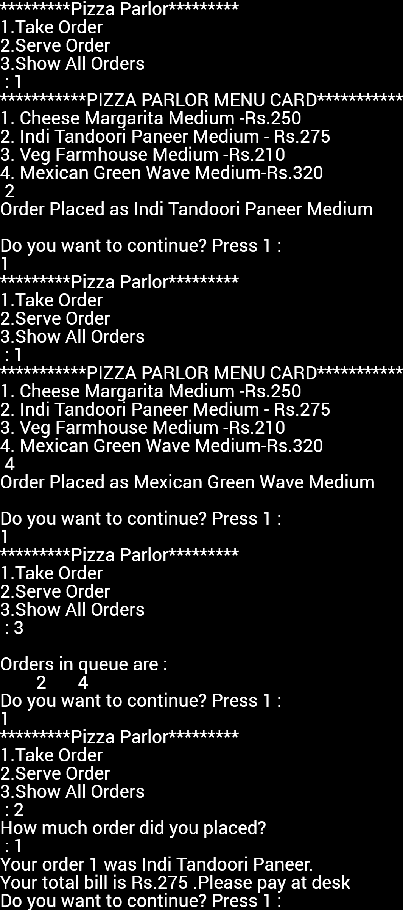

# Pizza Parlour Billing System
This is a program written in 'C++' to make the order management easy and avoid mistakes which occur in the traditional order management. Here for an example, I have considered a 'Pizza Parlour' in which we will implement this program which takes 'n' number of orders, displays orders which are received, serve the received order and show the amount to be paid. I have used a circular queue type abstract data structure which acts on first in first out basis to simulate the system.

## Getting Started
After downloading the following .txt file you will need to copy it into a IDE to get it running.


### Prerequisites
Firstly you will need to do some basic checkup. Make sure that your PC / Laptop meets these basic requirements:
1. Intel core i3
2. 2 GB RAM
3. 500 GB HDD
4. GCC or G++ compiler
5. IDE
   * [Code::Blocks 17.12](http://www.codeblocks.org/downloads)
   * [CodeLite 13.0.0](https://downloads.codelite.org/)
   * [JetBrains CLion 2019.3](https://www.jetbrains.com/clion/download/)
   
## Code
```c++
#include <iostream>                                                     /*header files*/
#include <string>                                                       /*header files*/
#include <cstring>                                                      /*header files*/
using namespace std;                                                    /*header files*/
const int MAX=10;                                                       /* const max=50*/
class PizzaOrder {                                                      /*class declaration Pizza*/
    char data[MAX];                                                     /*array for queue*/
    int front, rear,n;                                                  /* data members*/
    char a;
public:
    PizzaOrder();                                                       /*constructor declaration*/
    bool addEle(int );
    int delEle();
    void showQueue();
    void takeOrder();
    void serveOrder();
};
PizzaOrder ::PizzaOrder () {                                            /*construct0r*/
    front=rear=-1;
    for(int i=0;i<MAX;i++){
        data[i]=0;
    }
}
bool PizzaOrder ::addEle(int item){                                     /*function to add elements in circular queue*/
    if ((front == 0 && rear == MAX-1) || rear == front-1)
    {
        return false;
    }
    else if (front == -1)
    {
        front = rear = 0;
        data[rear] = item;
        return true;
    }
    else if (rear == MAX-1 && front != 0)
    {
        rear = 0;
        data[rear] = item;
        return true;
    }
    else
    {
        rear++;
        data[rear] = item;
        return true;
    }
}
int PizzaOrder ::delEle() {                                             /* finction to delete the element from circular queue*/
    int no;
    if (front == -1) {
        cout << "There is nothing in Order queue\n";

    }
    a = data[front];
    if (front == rear) {
        front = -1;
        rear = -1;
    } else {
        if (front == MAX - 1)
            front = 0;
        else
            front = front + 1;
    }
    return a;                                                           /*return element*/
}
void PizzaOrder ::takeOrder() {                                         /* function to take order*/
    int ch;
    cout << "***********PIZZA Parlour MENU CARD***********\n";
    cout << "1. Cheese Margarita Medium -Rs.250 \n2. Indi Tandoori Paneer Medium - Rs.275 \n3. Veg Farmhouse Medium -Rs.210 \n4. Mexican Green Wave Medium-Rs.320\n ";
    cin >> ch;                                                          /* element from user */
    switch (ch) {
        case 1:
            if (addEle('1')) {
                cout << "Order Placed as Cheese Margarita Medium\n";
            } else {
                cout << "Queue is full, Your Order is under Process, Please wait!!";
            }
            break;
        case 2:
            if (addEle('2')) {
                cout << "Order Placed as Indi Tandoori Paneer Medium\n";
            } else {
                cout << "Queue is full, Your Order is under Process, Please wait!!";
            }
            break;
        case 3:
            if (addEle('3')) {
                cout << "Order Placed as Veg Farmhouse Medium\n";
            } else {
                cout << "Queue is full, Your Order is under Process, Please wait!!";
            }
            break;
        case 4:
            if (addEle('4')) {
                cout << "Order Placed as Mexican Green Wave Medium\n";
            } else {
                cout << "Queue is full, Your Order is under Process, Please wait!!";
            }
            break;
    }
}
void PizzaOrder ::serveOrder() {                                          /* function to deque element as order of pizza*/
    int amt=0,no;
    cout<<"How much order did you placed? \n : ";
    cin>>no;
    for (int i = 0; i < no; i++) {
        switch (delEle()) {
            case '1':
                cout << "Your order " <<i+1<<" was Cheese Margarita. \n";
                amt = amt + 250;
                break;
            case '2':
                cout << "Your order "<<i+1<<" was Indi Tandoori Paneer. \n";
                amt = amt + 275;
                break;
            case '3':
                cout << "Your order "<<i+1<<" was Veg Farmhouse. \n";
                amt = amt + 210;
                break;
            case '4':
                cout << "Your order "<<i+1<<" was Mexican Green Wave. \n";
                amt = amt + 320;
                break;
            case '5':
                cout << "Pizza Order Queue is empty \n";
        }
    }
    cout<<"Your total bill is Rs."<<amt<<" .Please pay at desk";          /* reutrn element price total */
}
void PizzaOrder::showQueue()                                              /*function to show queue*/
{
    int t;
    if(front==rear==-1)
    {
        cout<<"\nThere is nothing in Order queue \n";
    }
    else
    {
        t=front;
        cout<<"\nOrders in queue are :\n";
        while(t!=rear)
        {
            cout<<"\t"<<data[t];
            t++;
        }
        cout<<"\t"<<data[t];
    }
}
int main(){                                                               /* main function*/
    PizzaOrder p;                                                         /* object declaration*/
    int ch,k;
    do {
        cout << "*********Pizza Parlour*********\n1.Take Order \n2.Serve Order \n3.Show All Orders \n : ";
        cin >> ch;
        switch (ch) {
            case 1:
                p.takeOrder();                                            /* calling take order function*/
                break;
            case 2:
                p.serveOrder();                                           /*calling serve order function*/
                break;
            case 3:
                p.showQueue();                                            /* function call to show queue*/
                break;
        }
        cout << "\nDo you want to continue? Press 1 :\n";
        cin >> k;
    }while(k==1);                                                         /* for k=1 , check condition to be true*/
    return 0;
}


```
### Output
<p align="center">
  
</p>
